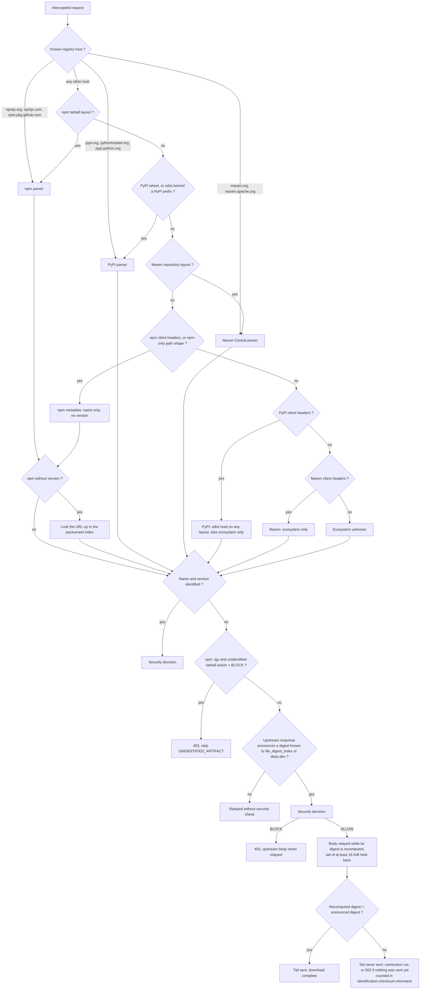
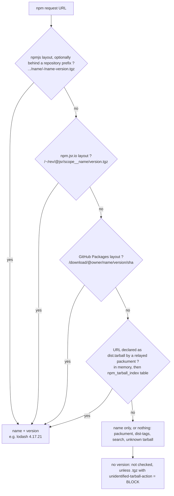
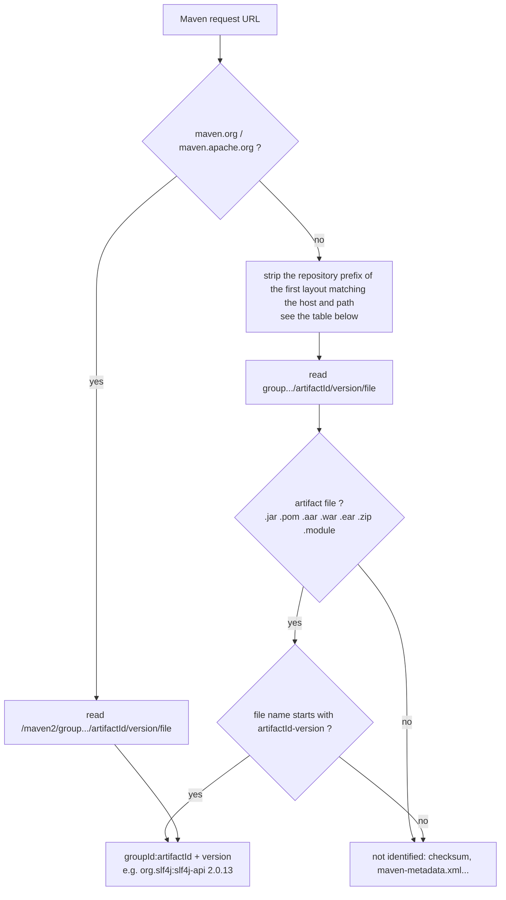
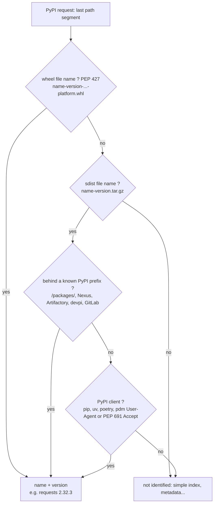

# Package identification

A request is only checked by SilicaProxy if its **ecosystem**, **package name** and **version** can
be identified ; otherwise it is relayed **without any security check** (counted in
`silicaproxy.controller.security.bypass`). This is the job of `PackageIdentificationService`, which
tries, in order :

1. the request URL (per-ecosystem layouts below) ;
2. the client headers ([Client header hints](#client-header-hints)) ;
3. for npm, the packuments relayed earlier ([npm tarball identification](#npm-tarball-identification)) ;
4. the upstream response itself ([Identification from the upstream response](#identification-from-the-upstream-response)).

See the [README](README.md) for the rest of the proxy's behaviour and configuration.

## How it works

The first diagram shows how the ecosystem is detected and what the proxy then does with the
request ; each ecosystem section below has its own diagram for the package name and version.

The URL is always read first ; the client headers are only consulted when the URL named no
ecosystem, so they can add an identification but never remove one. A request still unidentified
is counted in `silicaproxy.controller.security.bypass`. The digest check only applies to requests
identified from the upstream response : the announced digest is not trusted until the body proves it
([details](#identification-from-the-upstream-response)).

## npm tarball identification

A request is only checked if its package and version can be identified ; otherwise it is relayed
**without any security check** (counted in `silicaproxy.controller.security.bypass`). For npm, the
tarball is identified in two ways :

1. **From its URL**, whatever the host :
   - npmjs layout `/{name}/-/{name}-{version}.tgz` and `/@{scope}/{name}/-/{name}-{version}.tgz`,
     optionally behind a repository prefix (Artifactory `/artifactory/api/npm/{repo}`, Nexus
     `/repository/{repo}`, CodeArtifact…) — Artifactory's scoped form `-/@{scope}/{name}-{version}.tgz`
     is accepted too. The file name must repeat the package name ;
   - npm.jsr.io `/~/{rev}/@jsr/{scope}__{name}/{version}.tgz` ;
   - GitHub Packages `/download/@{owner}/{name}/{version}/{sha}`.
2. **From the packuments relayed earlier** (`silicaproxy.npm-packument-index.*`) : the proxy
   remembers every `dist.tarball` URL of the packuments it relays, for any other layout. Entries
   live in memory for `ttl-minutes` and are shared with the other instances through the
   `npm_tarball_index` table when they carry a publish date **or** when their URL cannot be
   identified by the patterns above (so a tarball request landing on another instance is still
   identified).

**Known limit** : a client that does not request the packument (e.g. `npm ci` with a lockfile)
on a registry whose layout matches none of the patterns cannot be identified. By default such a
tarball is relayed unchecked ; set `silicaproxy.npm-packument-index.unidentified-tarball-action`
to `BLOCK` to answer 403 (`step: UNIDENTIFIED_ARTIFACT`) instead. Metadata requests (packuments,
dist-tags, search) are never blocked by this option.

## Maven artifact identification

On `maven.org` / `maven.apache.org` the `/maven2/{group}/{artifact}/{version}/{file}` layout is
parsed directly. On any other host, the repository prefix is stripped before the rest is read as
`{group path}/{artifactId}/{version}/{file}` :

| Repository | Prefix stripped |
|---|---|
| Nexus 3 | `/repository/{repo}/`, optionally under `/nexus` |
| Nexus 2 (incl. `oss.sonatype.org`) | `/content/repositories/{repo}/`, `/content/groups/{repo}/`, optionally under `/nexus` |
| Artifactory | `/artifactory/{repo}/` |
| GitLab | `/api/v4/projects/{id}/packages/maven/`, `/api/v4/groups/{id}/-/packages/maven/` |
| AWS CodeArtifact (`*.amazonaws.com` only) | `/maven/{repo}/` |
| Azure Artifacts (`pkgs.dev.azure.com` only) | `/{org}/[{project}/]_packaging/{feed}/maven/v1/` |
| GitHub Packages (`maven.pkg.github.com` only) | `/{owner}/{repo}/` |
| Google Maven (`dl.google.com` / `maven.google.com` only) | `/dl/android/maven2/` / none |
| JitPack (`jitpack.io` only) | none |
| anything else | exactly one segment (repo.spring.io `/release/`, plugins.gradle.org `/m2/`…) |

Only artifact files are identified (`.jar`, `.pom`, `.aar`, `.war`, `.ear`, `.zip`, `.module` ;
never checksums or `maven-metadata.xml`), and the file name must repeat the coordinates :
`{artifactId}-{version}` followed by the extension or a `-{classifier}` (`{artifactId}-X-…` for a
`X-SNAPSHOT` version). Anything else is relayed without a security check.

**Known limit** : a custom layout with a multi-segment prefix that is not in the table above is
read with a one-segment prefix, so the remaining segments end up in the groupId and the package
is checked under a wrong name.

## PyPI file identification

A **wheel** is identified by its file name alone, whatever the host and path : its name is fully
self-describing (`{name}-{version}(-{build})?-{python tag}-{abi tag}-{platform}.whl`, PEP 427).
An **sdist** (`{name}-{version}.tar.gz`) is not — any tarball has that shape — so it is only
identified behind a known PyPI prefix :

| Repository | Prefix |
|---|---|
| pypi.org, files.pythonhosted.org and mirrors of that layout | `/packages/` |
| Nexus 3 | `/repository/{repo}/packages/`, optionally under `/nexus` |
| Artifactory | `/artifactory/api/pypi/{repo}/packages/` |
| devpi | `/{user}/{index}/+f/` |
| GitLab | `/api/v4/projects/{id}/packages/pypi/files/` |

or when the request comes from a PyPI client (see below). Wheels and sdists served by a private
repository are therefore **checked** : an internal package unknown to pypi.org gets `NOT_FOUND`
from the quarantine lookup, so it is blocked when `quarantine.unknown-version-action` is `BLOCK`
(otherwise [`quarantine.fail-open`](README.md#what-fail-open--fail-closed-means) decides) — as for npm and
Maven on private repositories.

## Client header hints

When the URL alone names no ecosystem, the client headers are read :

| Ecosystem | Recognised headers | Effect |
|---|---|---|
| npm | `User-Agent` `npm/`, `pnpm/`, `yarn/`, `bun/` ; `Accept: application/vnd.npm.install-v1+json` ; `npm-*` / `pacote-*` headers | metadata tagged `npm` (and learned by the packument index) |
| PyPI | `User-Agent` `pip/`, `uv/`, `poetry/`, `pdm/` ; `Accept: application/vnd.pypi.simple.v1+json` (PEP 691) | an sdist on any layout is identified and **checked** ; other requests tagged `pypi` |
| Maven | `User-Agent` `Apache-Maven/`, `Gradle/`, `Apache Ivy/`, `Coursier/` | requests tagged `maven` (the groupId/prefix split stays ambiguous, so no version) |

Headers can only add an identification the URL did not give, never remove one : a forged
`User-Agent` cannot bypass the check. **Limit** : behind an artifact repository (the deployment
described in [Deployment](README.md#deployment)), the proxy sees the repository's own
`User-Agent` (`Artifactory/…`, `Nexus/…`), so these hints only help clients that use the proxy
directly.

## Identification from the upstream response

When nothing above identifies a request (unknown layout, opaque download URL, `npm ci` on an
unknown registry…), the proxy gets a last chance from the upstream response itself, before
relaying its body and without any extra upstream call :

- **Source** : the file digest the upstream announces — `X-Checksum-Sha256`, else
  `X-Checksum-Sha1` (Artifactory, Maven Central), else an `ETag` that is exactly a quoted SHA-1
  (Nexus 3) — is looked up on deps.dev (`/v3/query?hash.type=…&hash.value=…`), which indexes npm,
  PyPI and Maven files. A digest matching one package version identifies it ; the request then
  goes through the full security decision like one identified from its URL (a BLOCK answers the
  usual 403 and the body is never relayed). Only `200` responses that are neither re-encoded
  (`Content-Encoding`) nor metadata (JSON, HTML, XML, text) are considered. The announced file
  name (`Content-Disposition`) is not used, as nothing can verify it.
- **Verification** : the announced digest is not trusted as-is — a malicious upstream could
  announce the digest of a harmless package. The proxy recomputes it while streaming and holds back
  the tail of the body (at least 16 KiB) until the end : on a mismatch the tail is never sent and
  the connection is cut (or a `502` is answered when nothing was sent yet), so the client's
  download fails. Logged as `ERROR` and counted in `silicaproxy.identification.checksum.mismatch`.
- **Storage** : identified digests are stored in the `file_digest_index` table (shared by all
  instances, never expired : a digest always designates the same file) and looked up there before
  deps.dev. Digests deps.dev does not identify (unknown, ambiguous) are not stored and are queried
  again on every download. A deps.dev outage leaves the request relayed unchecked, as without this
  feature ; a database failure only skips the table.
- **Configuration** : requires `silicaproxy.api-fallback.deps-dev.enabled`. To turn the whole
  feature off (no table read, no deps.dev call, unidentified requests relayed unchecked as before),
  set `silicaproxy.response-identification.enabled=false`
  (`SILICAPROXY_RESPONSE_IDENTIFICATION_ENABLED=false`).
- **Limits** : deps.dev only knows files of public packages — internal packages stay unidentified.
  A digest shared by several package versions is not used. Upstreams announcing no digest (plain
  registry.npmjs.org, files.pythonhosted.org) gain nothing.
- **Privacy** : only the digest is sent to deps.dev, never the URL, the package name or client
  headers.
